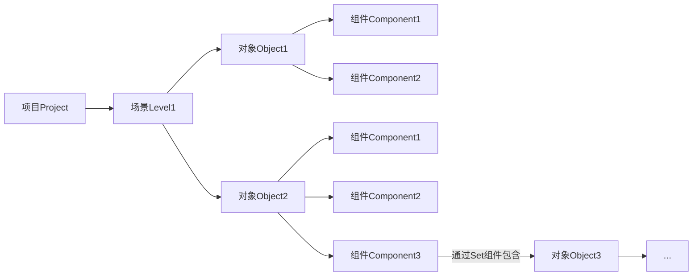
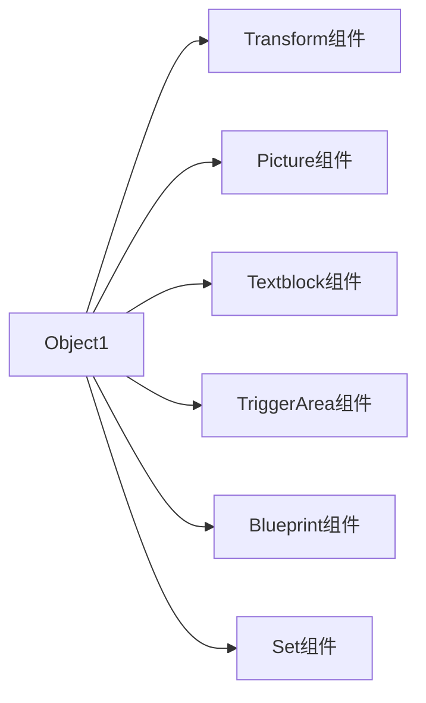

# 场景Json数据结构
```
状态机、场景、蓝图的具体逻辑暂未确定，故下面的数据结构主要是针对组件展开的
```
## 场景、对象、组件包含关系

## 具体数据结构
我们以一个父对象为场景的空对象为例，它可以包含以下种类的组件（每种最多不超过1个）

```json
{
  "NameOfLevel" : { 	//以下只写了对象的名字，实际结构包含完整对象数据
  			"NameOfObject1" : {
                //......
            },
      		//......
  	}
}
```
```json
{
  "NameOfObject1" : { 	//以下只写了组件的名字，实际结构包含完整组件数据
  			"Transform" : {
                //......
            },
      		//......
  	}
}
```
### Transform
```json
{
  "Transform" : { 
                "Location" : {	//使用相对父对象的坐标系
                	"x" : 0.0,	//float
                	"y" : 0.0,	//float
                	"z" : 0		//int，表示在场景空间中的相对深度
                },
                "Rotation" : {	//使用相对父对象的坐标系
                	"r" : 0.0	//float，单位为度，逆时针为正（以下度数变量正方向统一）
                },
                "Scale" : {		//<=0的数据视为1.0
                	"x" : 1.0,	//float，x轴方向上的缩放倍率
                	"y" : 1.0	//float，y轴方向上的缩放倍率
                }
        }
}
```
### Picture
```json
{
  "Picture" : { 
  				"Path" : ".\Pic\123.bmp",	//string，相对项目根目录的相对路径
                "Location" : {	//使用相对自己的坐标系（以下统称为局部坐标系）
                	"x" : 0.0,	//float
                	"y" : 0.0,	//float
                	"z" : 0		//int，表示在局部坐标系中的相对深度
                },
                "Rotation" : {	//使用局部坐标系
                	"r" : 0.0	//float，单位为度
                },
                "Size" : {		//使用局部坐标系，最后会与Transform的Scale乘算
                	"x" : 0.0,	//float，x轴方向上的视窗大小，设置为<=0的数表示使用原始图片大小作为视窗大小
                	"y" : 0.0	//float，y轴方向上的视窗大小，设置为<=0的数表示使用原始图片大小作为视窗大小
                }
        }
}
```
### Textblock
```json
{
  "Textblock" : { 
                "Location" : {	//使用屏幕空间坐标系
                	"x" : 0,		//int
                	"y" : 0		//int
                },
                "Size" : {
                	"x" : 0,	//int，x轴方向上的视窗大小，设置为<=0的数表示使用默认大小
                	"y" : 0	//int，y轴方向上的视窗大小，设置为<=0的数表示使用默认大小
                },
                "Text" : {
                	"component" : "your text",	//string，要显示的文本，可以由蓝图函数在运行时实时更新
                	"Font size" : 0,  	//int，单位为像素，设置为<=0的数表示使用默认大小
                	"ANSI Print" : false		//bool，表示是否启用ANSI解析文本，启用可以支持多颜色输出
                },
                "Scale" : {		//<=0的数据视为1.0
                	"x" : 1.0,	//float，x轴方向上的缩放倍率
                	"y" : 1.0	//float，y轴方向上的缩放倍率
                }
        }
}
```
### TriggerArea
```json
{
  "TriggerArea" : { 
                "Location" : {	//使用全局坐标系（即场景坐标系）
                	"x" : 0.0,	//float
                	"y" : 0.0	//float
                },
                "Size" : {		//<=0的数据视为0.0，使用全局坐标系
                	"x" : 0.0,	//float，x轴方向上的缩放倍率
                	"y" : 0.0	//float，y轴方向上的缩放倍率
                }
        }
}
```
### Blueprint
```json
{
  "Blueprint" : { 
  				"Path" : ".\Pic\123.bp"	//string，相对项目根目录的相对路径
  }
}
```
### Set
```json
{
  "Set" : { 
  			"Sub objects" : ["o1","o2"]	//string[]，以子对象的名字为元素
  	}
}
```
