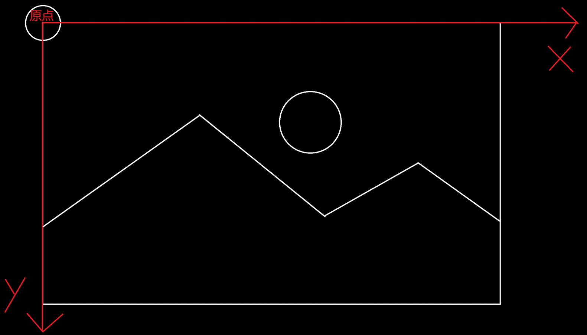

# 坐标系相关
## 一张图片的坐标系
在我们的引擎中，有且仅有一种图片类型：BMP_Data
```cpp
struct BMP_Pixel {
	unsigned char red;
	unsigned char green;
	unsigned char blue;
	unsigned char alpha;
};

struct BMP_Data {
	int width;
	int height;
	std::vector<BMP_Pixel> pixels;
};
```


在 `BMP_Data` 结构中，**坐标原点位于图像的左上角**，x 轴向右增加，y 轴向下增加。也就是说，`pixels[0]` 对应图像左上角第一个像素，`pixels[width-1]` 对应右上角，`pixels[(height-1)*width]` 对应左下角，`pixels[height*width-1]` 对应右下角

## 屏幕空间坐标系

与上面的图片坐标系相同

## 鼠标位置坐标系

与上面的图片坐标系相同

## 窗口坐标系

与上面的图片坐标系相同