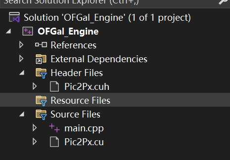

# 开发规范
## 项目文件管理

- **Source Files** 放源文件(.c、.cpp，.cu)程序的实现代码全放在这里
- **Header Files** 放头文件(.h，.cuh)声明放在这里
- **Resource Files** 资源文件(.rc)放图标、图片(.bmp)、菜单、文字之类的，主要用来做界面的东东一般都放这里 
- **External Dependencies** 除上三种以外的，程序编译时用到的文件全放这里

## 命名
变量与函数的名字使用驼峰命名法