## 引擎框架
### 概念定义
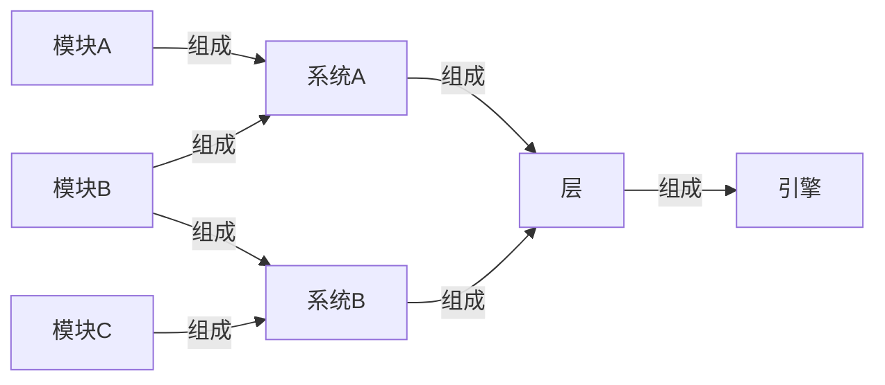
### 组成关系
#### 整体架构
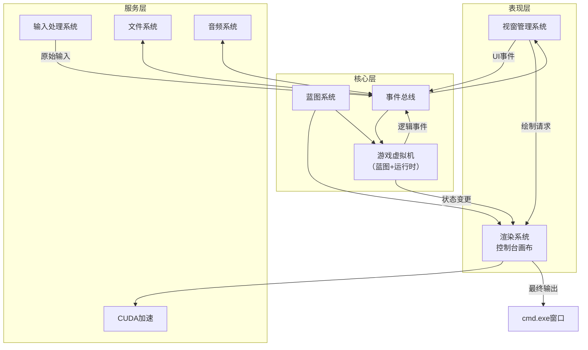
#### 局部框架
##### 视窗管理系统

##### 输入处理系统
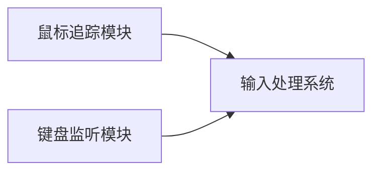
##### 文件系统
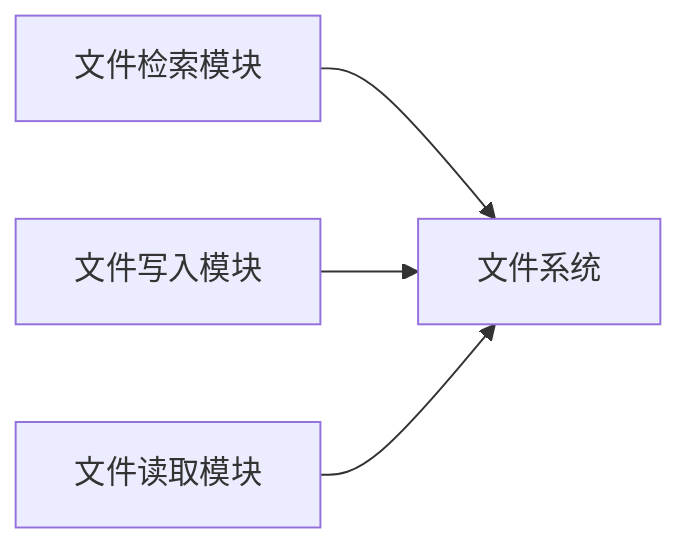
##### 音频系统
```
由于功能简单,所以无模块
```
##### 渲染系统
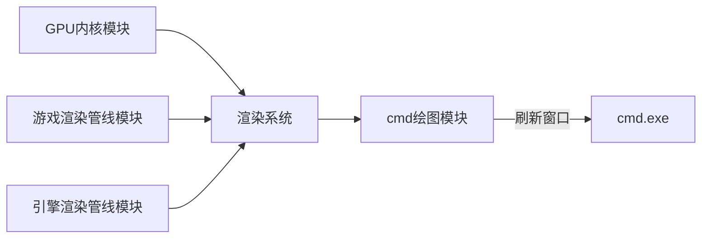
##### 游戏虚拟机
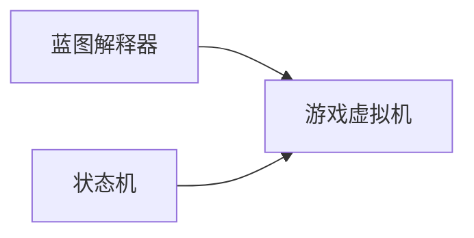
##### 蓝图系统
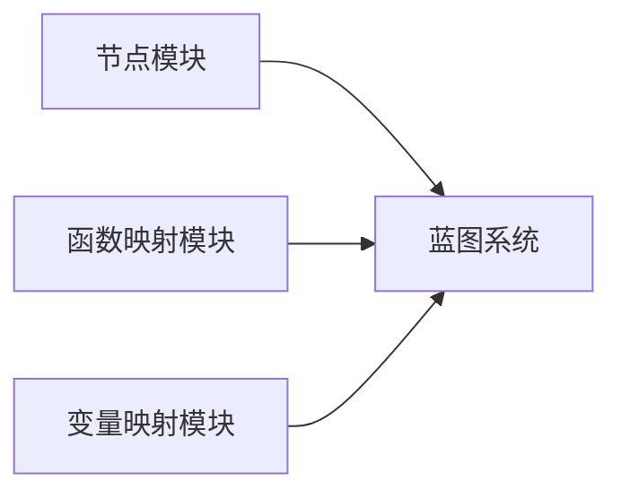
### 信息流
#### 什么是事件总线
事件总线（Event Bus）是一种设计模式，用于实现模块之间的松耦合通信。它基于发布-订阅（Publish-Subscribe）原理，允许不同组件在不直接引用对方的情况下互相发送和接收消息。
#### 输入处理系统
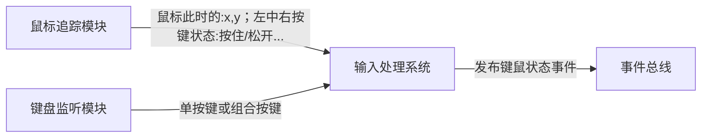
实时追踪鼠标状态，记录当前帧和上一帧的状态：(x,y)，左中右按键状态
实时监听键盘输入，记录当前帧和按下非字母/数字键的状态：按下的键、此前按下而释放的键
向事件总线发布事件
注意：监测不能阻塞主线程
#### 视窗管理系统
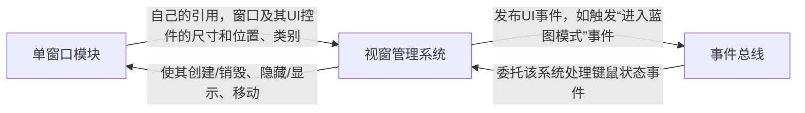
#### 文件系统
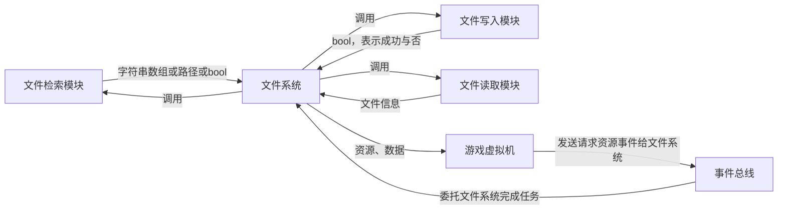
#### 音频系统
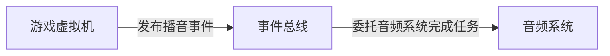
推荐使用MCI（媒体控制接口）完成，因为PlaySound局限性大，而DirectX可能不允许使用。
注意：需要考虑到有同时播放背景音乐、人声、音效的复杂场景，且播放不能阻塞主线程
#### 渲染系统
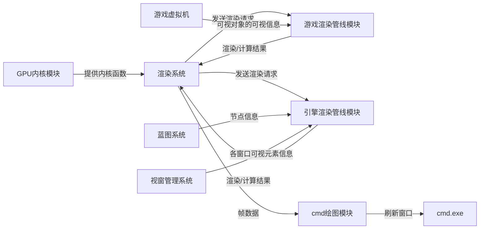
#### 游戏虚拟机
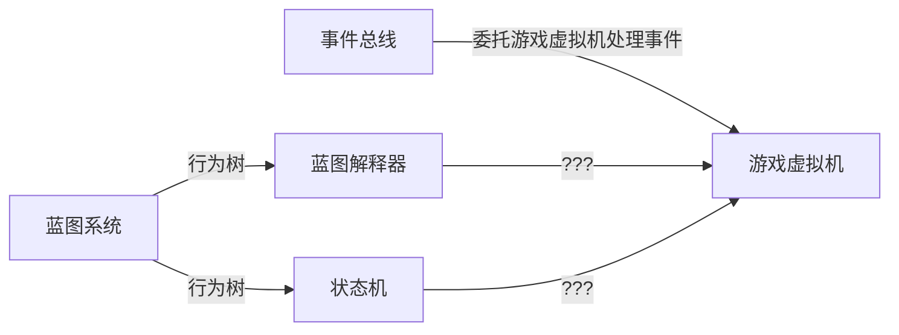
#### 蓝图系统
