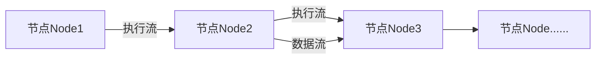

# 蓝图Json数据结构
## 蓝图、节点、变量包含关系

```mermaid
graph LR;
A[节点Node1]-->|执行流|B[节点Node2]
B[节点Node2]-->|执行流|C[节点Node3]
B[节点Node2]-->|数据流|C[节点Node3]
C[节点Node3]-->D[节点Node......]
```

这些节点、变量和流的集合被称为**蓝图**
## 具体数据结构
我们的蓝图以json格式保存和读写
### 节点Node
```json
{
	"id" : 00000000,				//使用8位整数来表示id
	"functionType" : "IntAddInt",	//整数加整数的加法函数
	
}
```